<h1>Отчет по лобораторной 02</h1>
 gmail почта - sgolenkov2002@gmail.com  
telegram - @Xacker_ducker

<h2>Ход выполнения лабораторной работы:</h2>

[репозиторий lab03](https://github.com/Alex1505Gold/lab03) 
На скриншотах выполненные команды и результат их выполнения
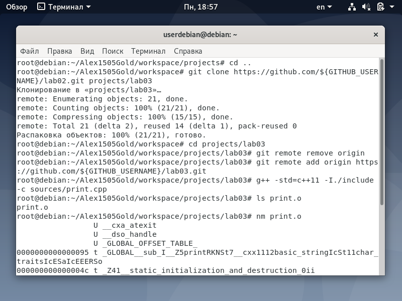 
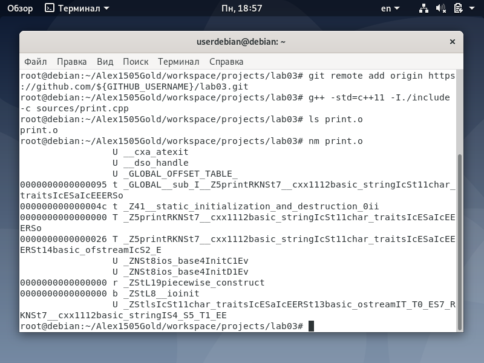 
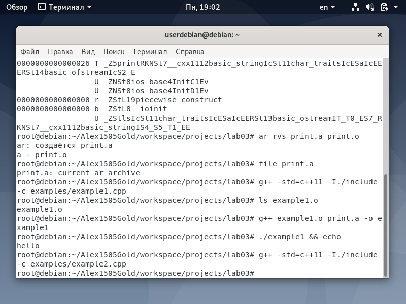 
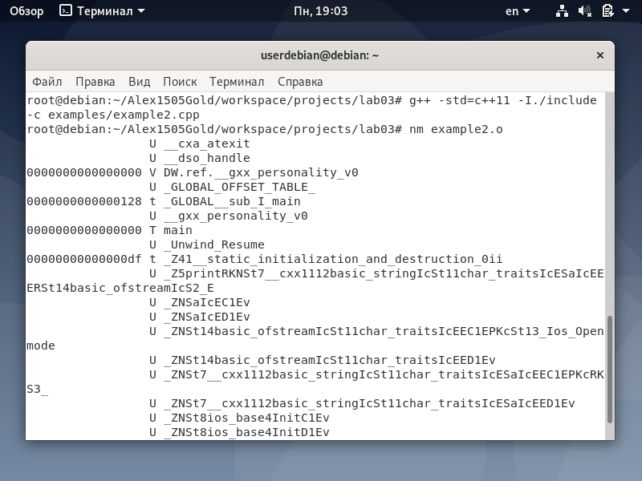 
 
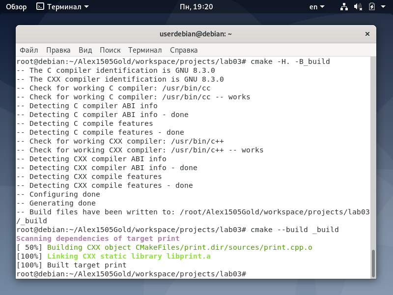 
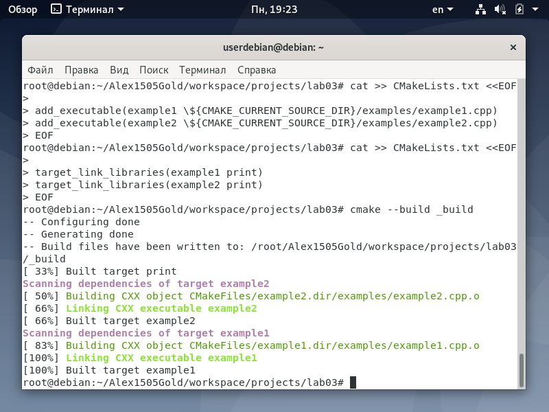 
 
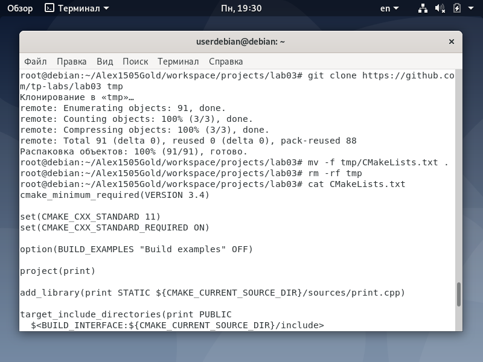 
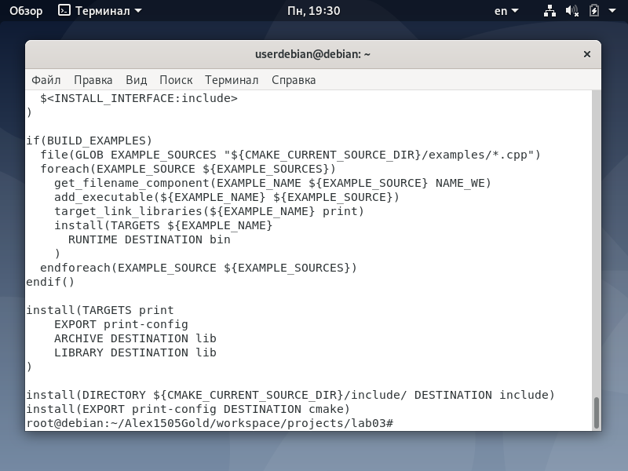 
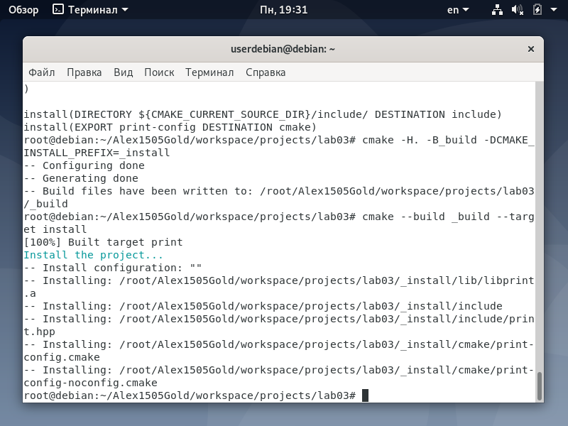 
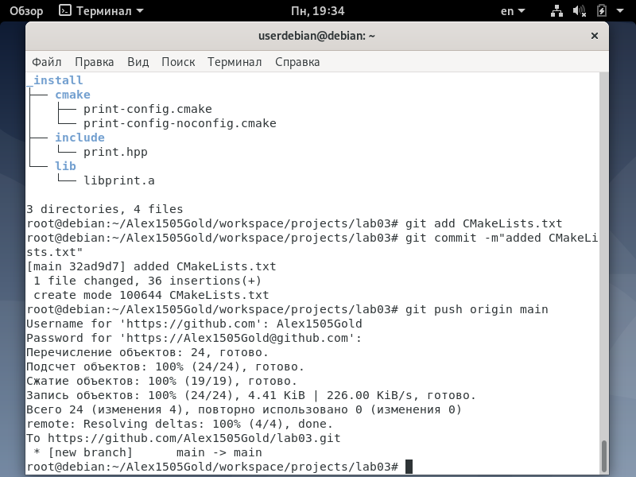 

<h2>Ход выполнения домашней работы:</h2>

При помощи следующих команд была создана новая директория, склонирован репозиторий и проинициализирован новый репозиторий 
'''
mkdir timp_lab03
cd timp_lab03
'''
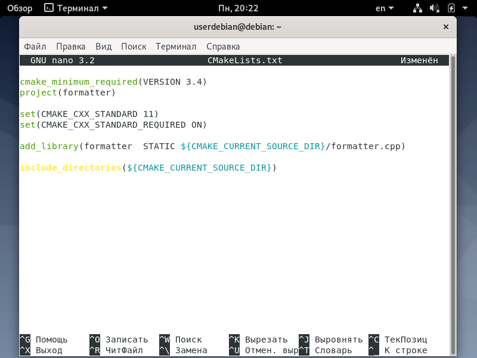 
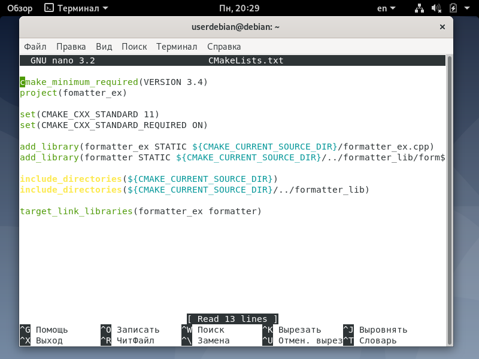 
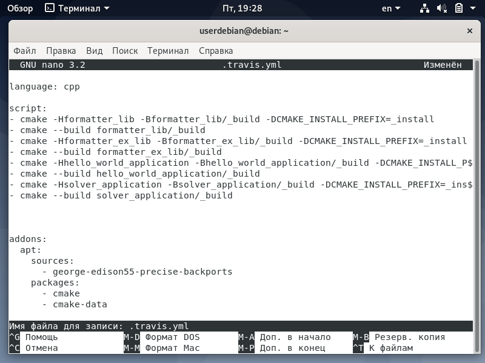 
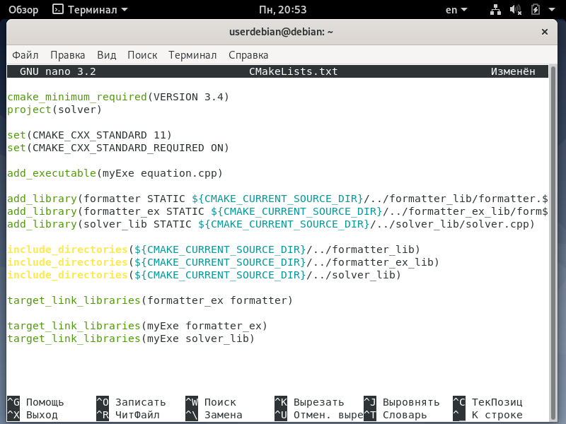 
