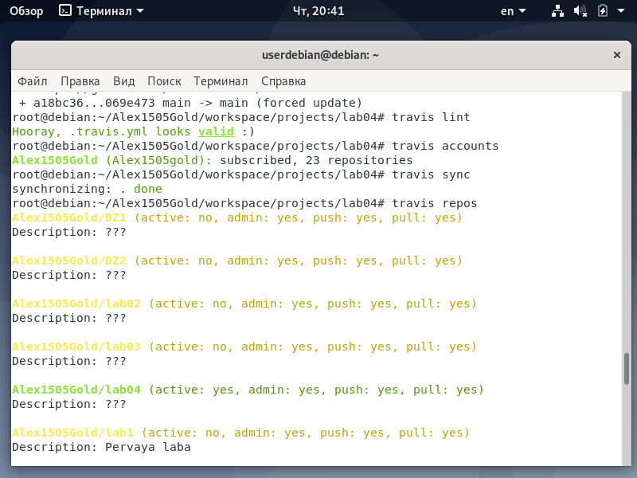
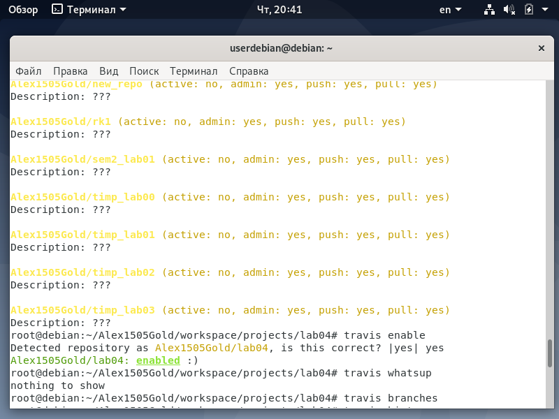

<h1>Отчет по лобораторной 04</h1>
</br>gmail почта - sgolenkov2002@gmail.com </br>
telegram - @Xacker_ducker

<h2>Ход выполнения лабораторной работы:</h2>

[репозиторий lab04](https://github.com/Alex1505Gold/lab04)</br>

```shell
export GITHUB_USERNAME=Alex1505Gold 
export GITHUB_TOKEN=

cd ${GITHUB_USERNAME}/workspace
pushd .
source scripts/activate

curl -sSL https://get.rvm.io | bash -s -- --ignore-dotfiles
```
Команда `echo "source $HOME/.rvm/scripts/rvm" >> scripts/activate` была заменена на `echo "source /usr/local/rvm/scripts/rvm" » scripts/activate` </br>
так как rvm был установлен именно так </br>
```shell
echo "source $HOME/.rvm/scripts/rvm" >> scripts/activate
. scripts/activate
rvm autolibs disable
rvm install ruby-2.4.2
rvm use 2.4.2 --default
gem install travis

git clone https://github.com/${GITHUB_USERNAME}/lab03 projects/lab04
cd projects/lab04
git remote remove origin
git remote add origin https://github.com/${GITHUB_USERNAME}/lab04

cat > .travis.yml <<EOF
language: cpp
EOF

cat >> .travis.yml <<EOF

script:
- cmake -H. -B_build -DCMAKE_INSTALL_PREFIX=_install
- cmake --build _build
- cmake --build _build --target install
EOF

cat >> .travis.yml <<EOF

addons:
  apt:
    sources:
      - george-edison55-precise-backports
    packages:
      - cmake
      - cmake-data
EOF

travis login --github-token ${GITHUB_TOKEN}

travis lint

ex -sc '1i|<фрагмент_вставки_значка>' -cx README.md

git add .travis.yml
git add README.md
git commit -m"added CI"
git push origin master

travis lint
travis accounts
travis sync
travis repos
travis enable
travis whatsup
travis branches
travis history
travis show
```

</br>
</br>

<h2>Ход выполнения домашней работы:</h2>


 </br>в файл был записан следующий код</br>
 
