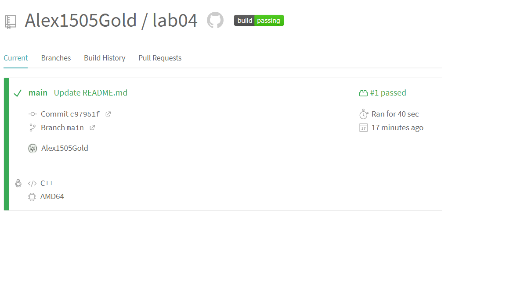
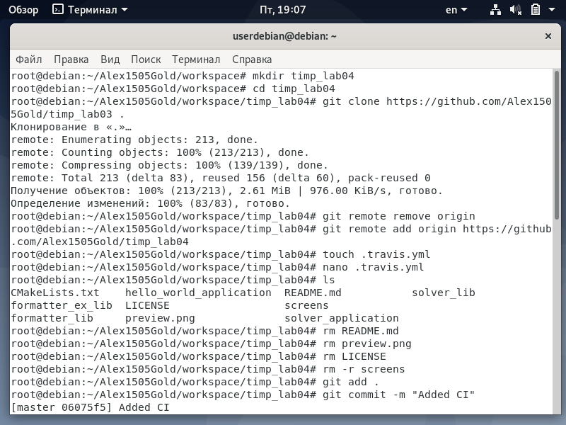

<h1>Отчет по лобораторной 03</h1>
</br>gmail почта - sgolenkov2002@gmail.com </br>
telegram - @Xacker_ducker

<h2>Ход выполнения лабораторной работы:</h2>

[репозиторий lab03](https://github.com/Alex1505Gold/lab03)</br>
На скриншотах выполненные команды и результат их выполнения
</br>
</br>
</br>
</br>
</br>
</br>
</br>
</br>
</br>
</br>
</br>
</br>

<h2>Ход выполнения домашней работы:</h2>

При помощи следующих команд была создана новая директория, склонирован репозиторий и проинициализирован новый репозиторий</br>
```
mkdir timp_lab03
cd timp_lab03
git clone https://github.com/tp-labs/lab03.git .
rm -rf CMakeLists.txt
rm -rf preview.png
rm -rf LICENSE
rm -rf README.md
git remote remove origin
git remote add origin https://github.com/Alex1505Gold/timp_lab03.git
```

В папке formatter_lib был создан файл CMakeLists.txt и открыт через nano для редактирования
```
cd formatter_lib<
touch CMakeLists.txt
nano CMakeLists.txt `
```
</br>
В файл было записано следующее</br>
</br>
Затем была создана папка _ build, в которую был собран проект</br>
```
mkdir _build
cd _build
cmake ..
cmake --build . `
```
</br>
Аналогичные действия были проведены с папкой formatter_ex_lib, однако в файл CMakeLists.txt было записано:</br>
</br>
Аналогичные действия были проведены с папкой hello_world_application, однако в файл CMakeLists.txt было записано:</br>
</br>
Аналогичные действия были проведены с папкой solver_application, однако в файл CMakeLists.txt было записано:</br>
</br>
После все было залито на гитхаб</br>
```
git add .
git commit -m "Complete task"
git push origin master
```
